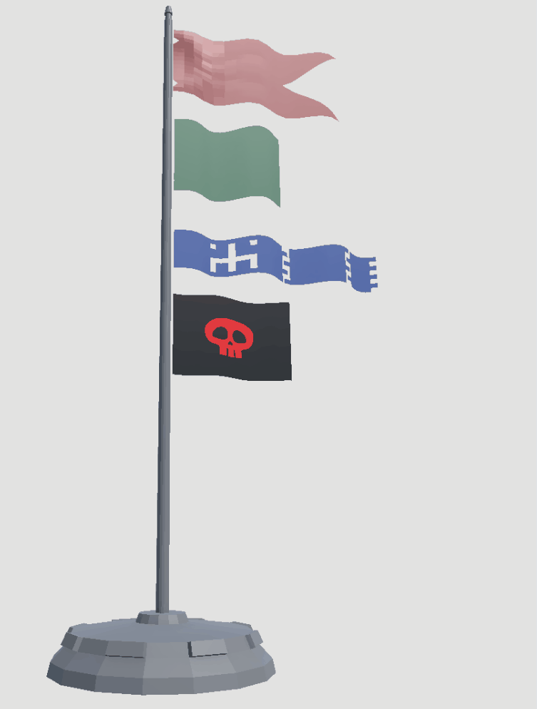
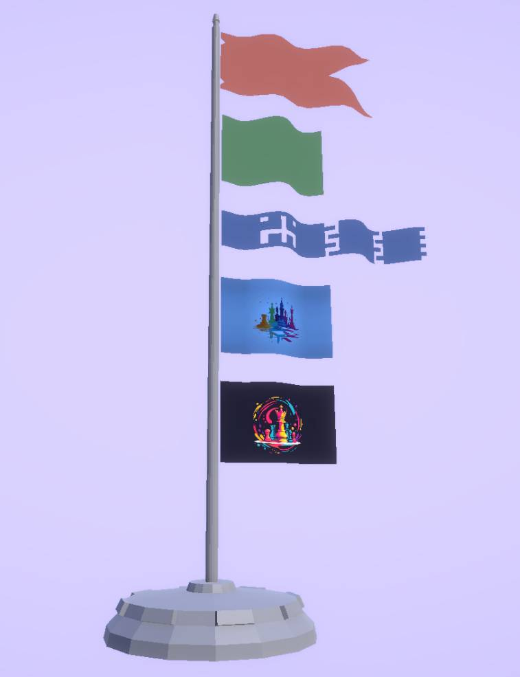

## Demo

This demo project demonstrates the following key features:

* **Exporting models using a Python script**

  * See `ScriptUtils\Config\readme.md` for setup instructions.
  * Add your configuration with the following fields:

    ```json
    {
      "unity_project_root": "Unity/Flag",
      "blender_path": "your_path_to_blender"
    }
    ```

* **Shader Graph implementation for a flag effect**

  * `LitFlag`: A simple lit shader using a color tint
  * `LitFlagTexture`: A version that combines texture sampling with color tinting


## Features

* 🚩 **No cloth simulation** — uses a lightweight shader-based waving effect (faster and more GPU-friendly)
* 🧭 **Works in object space** — the flag animation remains consistent even when the object is rotated
* 🎨 **Color support via `MaterialPropertyBlock`** — allows dynamic per-object coloring without duplicating materials (ideal for batching and memory efficiency)






## Tags

Unity Shader Graph, Flag Shader, Shader Animation, MaterialPropertyBlock, Unity Export Blender, Blender to Unity, GPU Efficient Animation, Unity Object Space, Unity Shader Demo, Unity Procedural Animation, Lightweight Shader, Unity Tint Texture, Unity Shader Graph Texture Color, Unity Shader Graph Flag